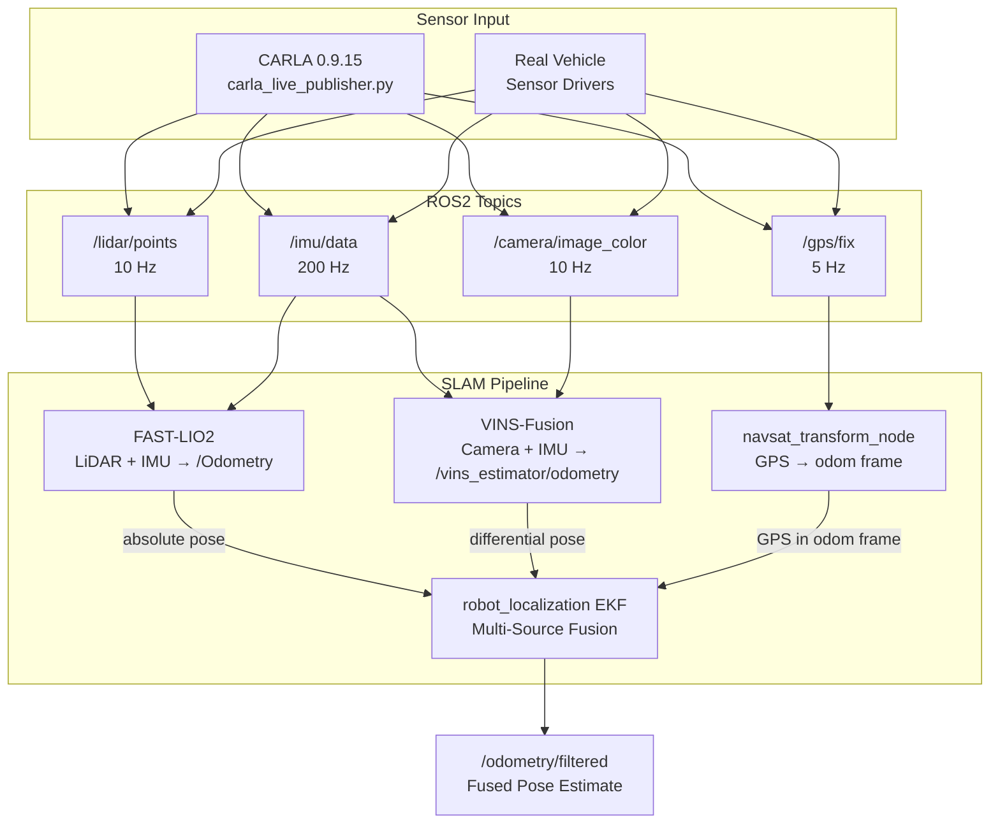
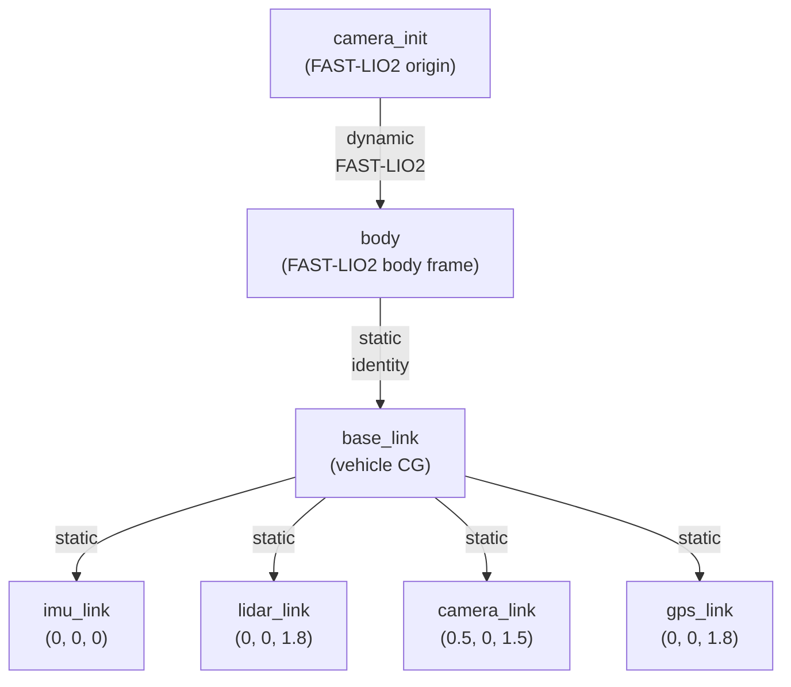

# LIO-VIO-GPS Fusion — Multi-Source SLAM Pipeline

[English](#overview) | [中文](#概述)

---

## Overview

A **ROS2 Humble** multi-source SLAM fusion pipeline combining:

- **FAST-LIO2** — LiDAR-Inertial Odometry (ikd-Tree + iterated Kalman filter)
- **VINS-Fusion** — Monocular Visual-Inertial Odometry (sliding-window optimization)
- **robot_localization** — EKF multi-source fusion + GPS integration

Supports both **CARLA 0.9.15 simulation** (with a built-in real-time sensor bridge) and **real vehicle deployment** (with sensor driver topics).

## 概述

一个 **ROS2 Humble** 多源 SLAM 融合管线，整合：

- **FAST-LIO2** — 激光雷达-惯性里程计（ikd-Tree + 迭代卡尔曼滤波）
- **VINS-Fusion** — 单目视觉-惯性里程计（滑动窗口优化）
- **robot_localization** — EKF 多源融合 + GPS 集成

同时支持 **CARLA 0.9.15 仿真**（内置实时传感器桥接）和 **实车部署**（传感器驱动话题）。

---

## System Architecture / 系统架构



## TF Tree / 坐标变换树



## Workspace Structure / 工作空间结构

```
lio_vio_gps_ws/
├── src/
│   ├── FAST_LIO_ROS2/            # git submodule — LiDAR-Inertial odometry
│   ├── VINS-Fusion-ROS2/         # git submodule — Visual-Inertial odometry
│   └── slam_bringup/             # Launch files, configs, CARLA bridge
│       ├── config/
│       │   ├── fastlio2_carla.yaml     # FAST-LIO2 config for CARLA sim
│       │   ├── fastlio2_real.yaml      # FAST-LIO2 config for real vehicle
│       │   ├── vins_carla_mono.yaml    # VINS-Fusion config for CARLA sim
│       │   ├── vins_real_mono.yaml     # VINS-Fusion config for real vehicle
│       │   └── ekf_navsat.yaml         # robot_localization EKF + NavSat
│       ├── launch/
│       │   ├── carla_full.launch.py    # Full CARLA sim pipeline
│       │   ├── slam_pipeline.launch.py # Real vehicle pipeline
│       │   ├── fastlio2.launch.py      # FAST-LIO2 standalone
│       │   ├── vins_fusion.launch.py   # VINS-Fusion standalone
│       │   └── ekf_fusion.launch.py    # EKF + NavSat standalone
│       └── slam_bringup/
│           └── carla_live_publisher.py # CARLA→ROS2 sensor bridge
├── carla_live_publisher.py         # Standalone bridge (root copy)
└── README.md
```

## ROS2 Topics / 话题

### Sensor Topics (Input)

| Topic | Type | Hz | Frame | Source |
|-------|------|----|-------|--------|
| `/clock` | `rosgraph_msgs/Clock` | 200 | — | CARLA bridge |
| `/imu/data` | `sensor_msgs/Imu` | 200 | `imu_link` | Bridge / IMU driver |
| `/lidar/points` | `sensor_msgs/PointCloud2` | 10 | `lidar_link` | Bridge / LiDAR driver |
| `/camera/image_color` | `sensor_msgs/Image` | 10 | `camera_link` | Bridge / Camera driver |
| `/camera/camera_info` | `sensor_msgs/CameraInfo` | 10 | `camera_link` | Bridge / Camera driver |
| `/gps/fix` | `sensor_msgs/NavSatFix` | 5 | `gps_link` | Bridge / GNSS driver |

### Odometry Topics (Output)

| Topic | Type | Hz | Source |
|-------|------|----|--------|
| `/Odometry` | `nav_msgs/Odometry` | ~10 | FAST-LIO2 |
| `/vins_estimator/odometry` | `nav_msgs/Odometry` | ~10 | VINS-Fusion |
| `/odometry/filtered` | `nav_msgs/Odometry` | 50 | robot_localization EKF |

### PointCloud2 Fields

| Field | Type | Offset |
|-------|------|--------|
| x | FLOAT32 | 0 |
| y | FLOAT32 | 4 |
| z | FLOAT32 | 8 |
| intensity | FLOAT32 | 12 |
| ring | UINT16 | 16 |
| time | FLOAT32 | 20 |

Point step: 24 bytes. `ring` (UINT16) matches FAST-LIO2's `velodyne_ros::Point` struct.

## Prerequisites / 环境要求

| Component | Version |
|-----------|---------|
| Ubuntu | 22.04 |
| ROS2 | Humble |
| Python | 3.10+ |
| CARLA | 0.9.15 (simulation only) |

### System Dependencies

```bash
# robot_localization
sudo apt install ros-humble-robot-localization

# VINS-Fusion build deps (Ceres Solver)
sudo apt install libceres-dev
```

### Python Dependencies (CARLA bridge)

```
carla==0.9.15
rclpy
sensor_msgs
tf2_ros
cv_bridge
numpy
```

## Quick Start / 快速开始

### Build / 编译

```bash
cd ~/lio_vio_gps_ws

# Initialize submodules
git submodule update --init --recursive

# Build
colcon build --symlink-install
source install/setup.bash
```

### CARLA Simulation / CARLA 仿真

```bash
# Terminal 1: Start CARLA
cd ~/carla_sim && ./CarlaUE4.sh

# Terminal 2: Launch full pipeline
conda activate carla_env
ros2 launch slam_bringup carla_full.launch.py

# Terminal 3: Verify
ros2 topic hz /Odometry                     # FAST-LIO2 ~10Hz
ros2 topic hz /vins_estimator/odometry       # VINS-Fusion ~10Hz
ros2 topic hz /odometry/filtered             # EKF ~50Hz
```

Or run the CARLA bridge standalone:

```bash
conda activate carla_env
python3 carla_live_publisher.py
```

### Real Vehicle / 实车部署

```bash
# Edit configs to match your sensors:
#   config/fastlio2_real.yaml   — LiDAR type, extrinsics
#   config/vins_real_mono.yaml  — camera intrinsics, IMU params
#   config/ekf_navsat.yaml      — set use_sim_time: false

ros2 launch slam_bringup slam_pipeline.launch.py
```

## Launch Files / 启动文件

| Launch File | Description |
|-------------|-------------|
| `carla_full.launch.py` | CARLA bridge + FAST-LIO2 + VINS-Fusion + EKF + NavSat |
| `slam_pipeline.launch.py` | Real vehicle: FAST-LIO2 + VINS-Fusion + EKF + NavSat |
| `fastlio2.launch.py` | FAST-LIO2 standalone with static TF |
| `vins_fusion.launch.py` | VINS-Fusion standalone |
| `ekf_fusion.launch.py` | robot_localization EKF + NavSat transform |

### Launch Arguments

```bash
# CARLA full pipeline
ros2 launch slam_bringup carla_full.launch.py \
    carla_host:=localhost carla_port:=2000 town:=Town10HD

# Real vehicle pipeline
ros2 launch slam_bringup slam_pipeline.launch.py \
    fastlio2_config:=fastlio2_real.yaml \
    vins_config:=vins_real_mono.yaml

# Individual nodes
ros2 launch slam_bringup fastlio2.launch.py \
    config_file:=fastlio2_carla.yaml use_sim_time:=true
```

## Configuration / 配置

### FAST-LIO2 Config

| Parameter | CARLA | Real (template) |
|-----------|-------|-----------------|
| `lidar_type` | 2 (Velodyne) | Depends on LiDAR |
| `scan_line` | 64 | Match your LiDAR |
| `timestamp_unit` | 0 (seconds) | Match your driver |
| `imu_topic` | `/imu/data` | `/imu/data` |
| `lid_topic` | `/lidar/points` | `/lidar/points` |
| `extrinsic_T` | `[0, 0, 1.8]` | Measure on vehicle |
| `use_sim_time` | `true` | `false` |

### VINS-Fusion Config

Uses **OpenCV YAML format** (`%YAML:1.0`). Key parameters:

| Parameter | CARLA | Real (template) |
|-----------|-------|-----------------|
| Camera model | PINHOLE 1280x720 | Calibrate your camera |
| `fx, fy` | 640.0 | From calibration |
| `body_T_cam0` | Known from CARLA | Calibrate IMU-Camera |
| `estimate_extrinsic` | 0 (fixed) | 1 (online calibration) |
| `estimate_td` | 0 | 1 (estimate time offset) |
| IMU noise | Conservative sim values | From IMU datasheet |

### EKF Fusion Config

| Input | Topic | Mode |
|-------|-------|------|
| FAST-LIO2 | `/Odometry` | Absolute (6-DOF pose) |
| VINS-Fusion | `/vins_estimator/odometry` | Differential (relative changes) |
| GPS | `/gps/fix` via navsat_transform | GPS→odom conversion |

## Coordinate System (CARLA Bridge) / 坐标系转换

```
CARLA (Left-Handed)              ROS (Right-Handed)
    Z up                              Z up
    |                                |
    +-------> Y (right)              +-------> X (forward)
   /                                /
  v X (forward)                    v Y (left)

Conversion:  ROS_X = CARLA_X,  ROS_Y = -CARLA_Y,  ROS_Z = CARLA_Z
```

| Data Type | Transform Rule |
|-----------|---------------|
| Position / Translation | `(x, -y, z)` |
| Linear Acceleration | `(ax, -ay, az)` |
| Angular Velocity | `(gx, -gy, -gz)` |
| Euler Rotation | `roll, -pitch, -yaw` -> quaternion |
| LiDAR Points | Negate Y column |

## Architecture Decisions / 设计决策

| Decision | Rationale |
|----------|-----------|
| **Loose coupling via EKF** | Each SLAM module runs independently; EKF fuses outputs. Easy to add/remove sensors |
| **FAST-LIO2 absolute + VINS differential** | LIO provides drift-free absolute pose; VIO adds complementary information in differential mode to avoid conflicting estimates |
| **CARLA bridge as clock server** | Deterministic lockstep: `/clock` published before sensor data each tick |
| **ring field as UINT16** | Matches FAST-LIO2's `velodyne_ros::Point` struct (PCL memcpy compatibility) |
| **OpenCV YAML for VINS** | VINS-Fusion reads config via OpenCV FileStorage, not standard YAML |
| **Separate sim/real configs** | Same launch structure, swap config file. Real configs have TODO markers |
| **Git submodules** | Self-contained workspace; pinned versions of FAST-LIO2 and VINS-Fusion |

## Cleanup (CARLA) / 清理

The CARLA bridge handles `SIGINT`/`SIGTERM` gracefully:

1. Stops and destroys all CARLA sensors
2. Destroys the vehicle actor
3. Restores CARLA to async mode

## License

MIT

---

*Multi-source SLAM fusion for autonomous driving research — simulation and real-world.*

*面向自动驾驶研究的多源 SLAM 融合管线 — 仿真与实车。*
