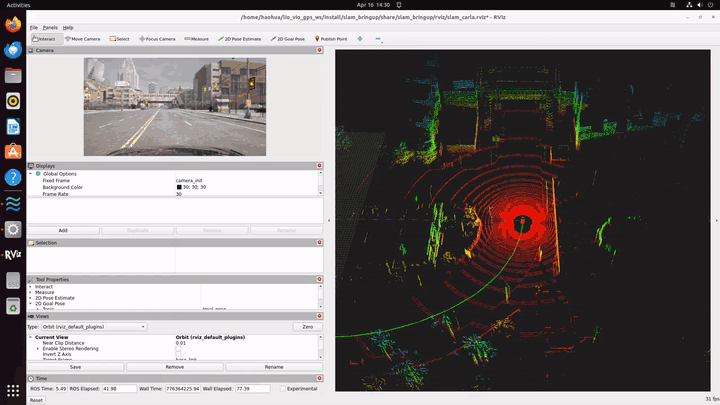
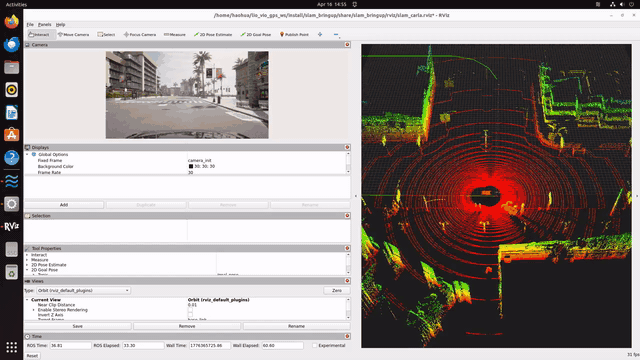
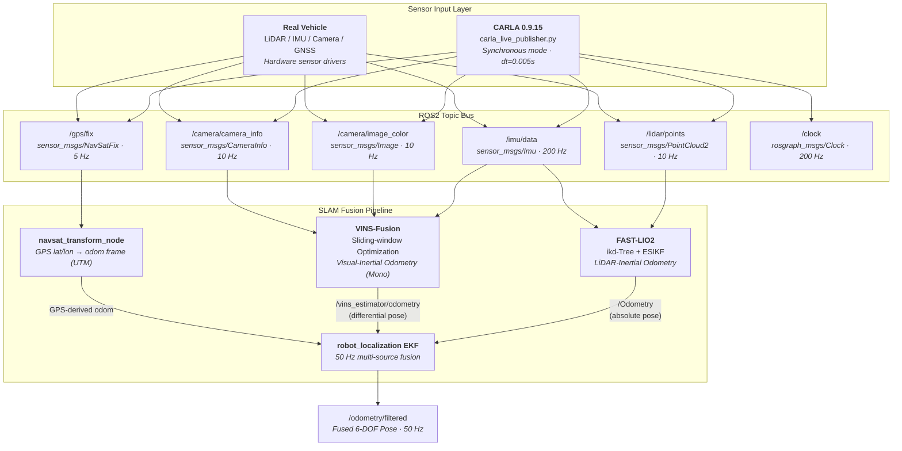
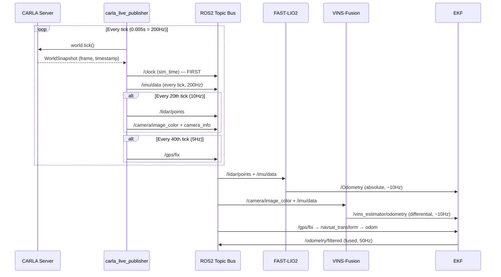
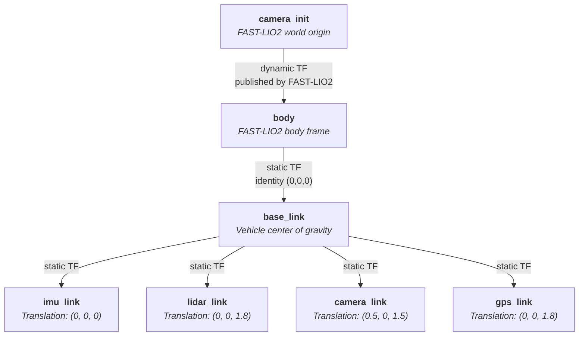

# LIO-VIO-GPS Fusion — Multi-Source SLAM Pipeline

> **[中文文档 (Chinese)](README_zh-CN.md)**

A **ROS2 Humble** multi-source SLAM fusion workspace that tightly integrates three complementary odometry systems into a single, loosely-coupled localization pipeline:

| Module | Algorithm | Input | Output |
|--------|-----------|-------|--------|
| **FAST-LIO2** | ikd-Tree + Iterated Error-State Kalman Filter | LiDAR + IMU | 6-DOF pose (absolute) |
| **VINS-Fusion** | Sliding-window nonlinear optimization (Ceres) | Mono Camera + IMU | 6-DOF pose (relative) |
| **robot_localization** | Extended Kalman Filter | Odometry sources + GPS | Fused global pose |

Supports both **CARLA 0.9.15 simulation** (with a built-in real-time sensor bridge and clock server) and **real vehicle deployment** (plug in your sensor drivers and go).

### Live demo — CARLA autopilot + real-time SLAM

**LIO only — pure FAST-LIO2 mapping (before GPS fusion was wired in):**



**LIO + GPS (dual-EKF) — GPS pulls the odom frame back to the global datum:**



*Tesla Model 3 under CARLA autopilot (traffic lights ignored so the recording stays in motion). The right pane is the unified `slam_carla.rviz` — rainbow accumulated map from FAST-LIO2, the bright red ring is the current registered scan, the top-left inset is the live front camera. Pipeline and RViz are launched with one command (`ros2 launch slam_bringup carla_full.launch.py`).*

### Status at a glance

| Component | State | Notes |
|-----------|-------|-------|
| CARLA bridge (`carla_bridge`) | ✅ working | autopilot + spectator chase + ignore lights/signs |
| FAST-LIO2 (LiDAR + IMU) | ✅ working | 10 Hz, ~65k pts/scan, CARLA-tuned LiDAR density |
| robot_localization — local EKF | ✅ working | `ekf_filter_node_odom` publishes `odom → base_link` from LIO (+ VIO) |
| robot_localization — global EKF | ✅ working | `ekf_filter_node_map` fuses LIO + GPS, publishes `map → odom`, corrects LIO drift |
| GPS / GNSS | ✅ fused | `navsat_transform_node` turns `/gps/fix` into `/odometry/gps`, consumed by the global EKF |
| VINS-Fusion (camera + IMU) | 🚧 WIP | config now parses; segfaults on first frame (image encoding / distortion path), off by default |
| Unified RViz layout | ✅ working | `slam_carla.rviz` auto-launched; toggle with `rviz:=false` |

---

## Table of Contents

- [System Architecture](#system-architecture)
- [Data Flow](#data-flow)
- [TF Tree](#tf-tree)
- [Workspace Structure](#workspace-structure)
- [Prerequisites](#prerequisites)
- [Build](#build)
- [Quick Start — CARLA Simulation](#quick-start--carla-simulation)
- [Quick Start — Real Vehicle](#quick-start--real-vehicle)
- [ROS2 Topics](#ros2-topics)
- [Launch Files](#launch-files)
- [Configuration Guide](#configuration-guide)
- [CARLA Sensor Bridge Details](#carla-sensor-bridge-details)
- [Architecture Decisions](#architecture-decisions)
- [Troubleshooting](#troubleshooting)
- [License](#license)

---

## System Architecture



### Why This Architecture?

- **Loose coupling** — Each SLAM module runs as an independent ROS2 node. If one module crashes or produces bad data, the others continue. You can add or remove sensors without modifying the core pipeline.
- **FAST-LIO2 as primary** — LiDAR-Inertial odometry is geometrically rich and drift-resistant. It provides the absolute pose reference for the EKF.
- **VINS-Fusion as complementary** — Visual-Inertial odometry captures texture information that LiDAR misses (e.g., in feature-sparse environments). Fused in **differential mode** so its accumulated drift doesn't conflict with FAST-LIO2's absolute estimate.
- **GPS for global anchoring** — `navsat_transform_node` converts WGS84 coordinates to the local odometry frame, preventing long-term drift in outdoor scenarios.

---

## Data Flow



**Key timing rule**: The CARLA bridge publishes `/clock` **before** any sensor data on each tick. This ensures all downstream `use_sim_time` nodes have advanced their clock before receiving new measurements.

---

## TF Tree



| Transform | Type | Publisher | Notes |
|-----------|------|----------|-------|
| `camera_init` → `body` | Dynamic | FAST-LIO2 | Updated at LiDAR scan rate (~10 Hz) |
| `body` → `base_link` | Static | `fastlio2.launch.py` | Identity — bridges FAST-LIO2 frame to ROS convention |
| `base_link` → `imu_link` | Static | CARLA bridge / `slam_pipeline.launch.py` | Co-located with base_link |
| `base_link` → `lidar_link` | Static | CARLA bridge / `slam_pipeline.launch.py` | 1.8m above base_link |
| `base_link` → `camera_link` | Static | CARLA bridge / `slam_pipeline.launch.py` | 0.5m forward, 1.5m up |
| `base_link` → `gps_link` | Static | CARLA bridge / `slam_pipeline.launch.py` | 1.8m above base_link |

---

## Workspace Structure

```
lio_vio_gps_ws/
├── src/
│   ├── FAST_LIO_ROS2/                  # [git submodule] Ericsii/FAST_LIO_ROS2
│   │   ├── config/                     #   Built-in configs (avia, velodyne, ouster, mid360)
│   │   ├── launch/mapping.launch.py    #   Native launch file
│   │   └── src/                        #   C++ source (laserMapping, preprocess, IMU_Processing)
│   │
│   ├── VINS-Fusion-ROS2/              # [git submodule] fanhong-li/VINS-Fusion-ROS2-Humble
│   │   ├── vins/                       #   Core VIO estimator (vins_node)
│   │   ├── loop_fusion/               #   Loop closure (optional)
│   │   ├── global_fusion/             #   GPS+VIO global optimization (optional)
│   │   └── camera_models/             #   Camera model library
│   │
│   └── slam_bringup/                  # [ament_python] Our integration package
│       ├── package.xml
│       ├── setup.py / setup.cfg
│       ├── config/
│       │   ├── fastlio2_carla.yaml     #   FAST-LIO2 — CARLA simulation
│       │   ├── fastlio2_real.yaml      #   FAST-LIO2 — real vehicle (template)
│       │   ├── vins_carla_mono.yaml    #   VINS-Fusion — CARLA mono camera
│       │   ├── vins_real_mono.yaml     #   VINS-Fusion — real vehicle (template)
│       │   └── ekf_navsat.yaml         #   robot_localization EKF + NavSat
│       ├── launch/
│       │   ├── carla_full.launch.py    #   CARLA bridge + full SLAM pipeline
│       │   ├── slam_pipeline.launch.py #   Real vehicle SLAM pipeline
│       │   ├── fastlio2.launch.py      #   FAST-LIO2 standalone
│       │   ├── vins_fusion.launch.py   #   VINS-Fusion standalone
│       │   └── ekf_fusion.launch.py    #   EKF + NavSat standalone
│       └── slam_bringup/
│           ├── __init__.py
│           └── carla_live_publisher.py #   CARLA→ROS2 sensor bridge
│
├── carla_live_publisher.py            # Root copy for standalone use
├── README.md                          # English documentation
├── README_zh-CN.md                    # Chinese documentation
├── .gitignore
└── .gitmodules
```

---

## Prerequisites

| Component | Version | Required For |
|-----------|---------|-------------|
| Ubuntu | 22.04 LTS | All |
| ROS2 | Humble Hawksbill | All |
| Python | 3.10+ | All |
| Ceres Solver | 2.0+ | VINS-Fusion |
| PCL | 1.12+ | FAST-LIO2 |
| Eigen | 3.3+ | FAST-LIO2, VINS-Fusion |
| CARLA | 0.9.15 | Simulation only |
| Conda env `carla_env` | — | CARLA bridge only |

### System Dependencies

```bash
# ROS2 packages
sudo apt install ros-humble-robot-localization \
                 ros-humble-pcl-conversions \
                 ros-humble-tf2-ros \
                 ros-humble-cv-bridge

# VINS-Fusion build dependencies
sudo apt install libceres-dev libgoogle-glog-dev libgflags-dev

# Optional: visualization
sudo apt install ros-humble-rviz2
```

### Python Dependencies (CARLA bridge only)

Inside the `carla_env` conda environment:

```
carla==0.9.15       # CARLA PythonAPI
rclpy               # ROS2 Python client
sensor_msgs         # Imu, PointCloud2, Image, CameraInfo, NavSatFix
tf2_ros             # StaticTransformBroadcaster
cv_bridge           # OpenCV ↔ ROS image conversion
numpy               # Array operations for PointCloud2 packing
```

---

## Build

```bash
# 1. Clone the repository
git clone --recursive git@github.com:UGA-MOBILITY-LAB/lio_vio_gps_ws.git
cd lio_vio_gps_ws

# 2. Initialize submodules (if not cloned with --recursive)
git submodule update --init --recursive

# 3. Install system dependencies
sudo apt install ros-humble-robot-localization libceres-dev

# 4. Build the workspace
source /opt/ros/humble/setup.bash
colcon build --symlink-install

# 5. Source the workspace
source install/setup.bash
```

> **Note**: FAST-LIO2 and VINS-Fusion are C++ packages and may take several minutes to compile on the first build.

---

## Quick Start — CARLA Simulation

### Terminal 1: Start CARLA Server

```bash
cd ~/carla_sim
./CarlaUE4.sh
# Wait for the CARLA window to fully load
```

### Terminal 2: Launch the Full Pipeline (one command)

```bash
conda activate carla_env
source ~/lio_vio_gps_ws/install/setup.bash
ros2 launch slam_bringup carla_full.launch.py
# optional flags:
#   rviz:=false   # headless, no RViz window
#   vins:=true    # enable VINS-Fusion (currently WIP, off by default)
```

This single command launches:
1. **carla_live_publisher** — connects to CARLA, spawns vehicle + sensors, publishes all topics + `/clock`; spectator camera chases the ego vehicle so the CARLA window always shows it
2. **FAST-LIO2** — subscribes to `/lidar/points` + `/imu/data`, publishes `/Odometry` and the accumulated map on `/Laser_map`
3. **VINS-Fusion** — optional (`vins:=true`), subscribes to `/camera/image_color` + `/imu/data`, publishes `/vins_estimator/odometry`
4. **robot_localization EKF** — fuses `/Odometry` (+ `/vins_estimator/odometry` when VINS is on), publishes `/odometry/filtered`
5. **navsat_transform** — converts `/gps/fix` to the map frame
6. **RViz2** — opens with `slam_carla.rviz` showing camera feed, FAST-LIO map, odometry paths, and TF (toggle with `rviz:=false`)

### Terminal 3: Verify Everything

```bash
source ~/lio_vio_gps_ws/install/setup.bash

# Check all topics are alive
ros2 topic list

# Verify frequencies
ros2 topic hz /imu/data                  # Expect ~200 Hz
ros2 topic hz /lidar/points              # Expect ~10 Hz
ros2 topic hz /camera/image_color        # Expect ~10 Hz
ros2 topic hz /gps/fix                   # Expect ~5 Hz
ros2 topic hz /clock                     # Expect ~200 Hz
ros2 topic hz /Odometry                  # Expect ~10 Hz (FAST-LIO2)
ros2 topic hz /vins_estimator/odometry   # Expect ~10 Hz (VINS-Fusion)
ros2 topic hz /odometry/filtered         # Expect ~50 Hz (EKF)

# Inspect TF tree
ros2 run tf2_tools view_frames
# → generates frames.pdf showing the full TF tree

# Visualize in RViz2
ros2 run rviz2 rviz2
# Add displays: PointCloud2 (/lidar/points), Image (/camera/image_color),
# Odometry (/Odometry, /odometry/filtered), TF
```

### Or Run CARLA Bridge Standalone

```bash
conda activate carla_env
cd ~/lio_vio_gps_ws
python3 carla_live_publisher.py

# With custom parameters:
python3 carla_live_publisher.py --ros-args \
    -p carla_host:=localhost \
    -p carla_port:=2000 \
    -p town:=Town01 \
    -p vehicle_filter:=vehicle.tesla.model3 \
    -p fixed_delta_seconds:=0.005
```

---

## Quick Start — Real Vehicle

### 1. Configure Your Sensors

Edit the `*_real.yaml` config files to match your hardware. All lines marked with `# TODO` need to be updated:

**FAST-LIO2** (`config/fastlio2_real.yaml`):
```yaml
preprocess:
    lidar_type: 2            # 1=Livox Avia, 2=Velodyne, 3=Ouster, 4=Livox Mid-360
    scan_line: 64            # Number of channels on your LiDAR
    timestamp_unit: 0        # 0=sec, 1=ms, 2=us, 3=ns (match your driver)
mapping:
    extrinsic_T: [0, 0, 0]  # LiDAR → IMU translation [x, y, z] in meters
    extrinsic_R: [1, 0, 0, 0, 1, 0, 0, 0, 1]  # LiDAR → IMU rotation (row-major)
```

**VINS-Fusion** (`config/vins_real_mono.yaml`):
```yaml
# From camera calibration (e.g., kalibr or OpenCV)
projection_parameters:
    fx: 640.0    # Fill from calibration
    fy: 640.0
    cx: 640.0
    cy: 360.0
distortion_parameters:
    k1: 0.0      # Fill from calibration
    k2: 0.0
    p1: 0.0
    p2: 0.0

# From IMU datasheet
acc_n: 0.1       # Accelerometer noise density [m/s^2/sqrt(Hz)]
gyr_n: 0.01      # Gyroscope noise density [rad/s/sqrt(Hz)]
acc_w: 0.001     # Accelerometer random walk [m/s^3/sqrt(Hz)]
gyr_w: 0.0001    # Gyroscope random walk [rad/s^2/sqrt(Hz)]

# IMU-Camera extrinsic (measure or calibrate with kalibr)
body_T_cam0: !!opencv-matrix
    rows: 4
    cols: 4
    dt: d
    data: [1, 0, 0, 0,  0, 1, 0, 0,  0, 0, 1, 0,  0, 0, 0, 1]
```

### 2. Launch

```bash
source ~/lio_vio_gps_ws/install/setup.bash

# Start your sensor drivers first (LiDAR, IMU, Camera, GPS)
# Then launch the SLAM pipeline:
ros2 launch slam_bringup slam_pipeline.launch.py \
    fastlio2_config:=fastlio2_real.yaml \
    vins_config:=vins_real_mono.yaml
```

### 3. Expected Topics from Sensor Drivers

Your sensor drivers must publish these topics before launching the pipeline:

| Topic | Type | Expected Rate |
|-------|------|---------------|
| `/imu/data` | `sensor_msgs/Imu` | 100–400 Hz |
| `/lidar/points` | `sensor_msgs/PointCloud2` | 10–20 Hz |
| `/camera/image_color` | `sensor_msgs/Image` | 10–30 Hz |
| `/gps/fix` | `sensor_msgs/NavSatFix` | 1–10 Hz |

---

## ROS2 Topics

### Sensor Topics (Input)

| Topic | Message Type | Hz | Frame ID | Consumer |
|-------|-------------|-----|----------|----------|
| `/clock` | `rosgraph_msgs/Clock` | 200 | — | All nodes (sim time) |
| `/imu/data` | `sensor_msgs/Imu` | 200 | `imu_link` | FAST-LIO2, VINS-Fusion |
| `/lidar/points` | `sensor_msgs/PointCloud2` | 10 | `lidar_link` | FAST-LIO2 |
| `/camera/image_color` | `sensor_msgs/Image` | 10 | `camera_link` | VINS-Fusion |
| `/camera/camera_info` | `sensor_msgs/CameraInfo` | 10 | `camera_link` | VINS-Fusion |
| `/gps/fix` | `sensor_msgs/NavSatFix` | 5 | `gps_link` | navsat_transform |

### Odometry Topics (Output)

| Topic | Message Type | Hz | Source | EKF Mode |
|-------|-------------|-----|--------|----------|
| `/Odometry` | `nav_msgs/Odometry` | ~10 | FAST-LIO2 | **Absolute** — primary pose source |
| `/vins_estimator/odometry` | `nav_msgs/Odometry` | ~10 | VINS-Fusion | **Differential** — relative changes only |
| `/odometry/filtered` | `nav_msgs/Odometry` | 50 | robot_localization EKF | — Final fused output |

### PointCloud2 Field Layout

| Field | Datatype | Offset | Size |
|-------|----------|--------|------|
| `x` | FLOAT32 | 0 | 4 |
| `y` | FLOAT32 | 4 | 4 |
| `z` | FLOAT32 | 8 | 4 |
| `intensity` | FLOAT32 | 12 | 4 |
| `ring` | **UINT16** | 16 | 2 |
| *(padding)* | — | 18 | 2 |
| `time` | FLOAT32 | 20 | 4 |

**Point step: 24 bytes**. The `ring` field is `UINT16` (not `FLOAT32`) to match FAST-LIO2's `velodyne_ros::Point` struct in `preprocess.h`. This is critical — PCL's `fromROSMsg` uses `memcpy` with `min(src_size, dest_size)` bytes, so a type mismatch produces garbage ring values.

---

## Launch Files

| File | Description | `use_sim_time` |
|------|-------------|----------------|
| `carla_full.launch.py` | CARLA bridge + FAST-LIO2 + VINS-Fusion + EKF + NavSat | `true` (except bridge) |
| `slam_pipeline.launch.py` | FAST-LIO2 + VINS-Fusion + EKF + NavSat (no CARLA) | `false` |
| `fastlio2.launch.py` | FAST-LIO2 + static TF `body→base_link` | Configurable |
| `vins_fusion.launch.py` | VINS-Fusion estimator | Configurable |
| `ekf_fusion.launch.py` | robot_localization EKF + navsat_transform | Configurable |

### Launch Arguments

| Argument | Default | Used By |
|----------|---------|---------|
| `use_sim_time` | `true` | All launch files |
| `config_file` | varies | `fastlio2.launch.py`, `vins_fusion.launch.py` |
| `fastlio2_config` | `fastlio2_real.yaml` | `slam_pipeline.launch.py` |
| `vins_config` | `vins_real_mono.yaml` | `slam_pipeline.launch.py` |
| `carla_host` | `localhost` | `carla_full.launch.py` |
| `carla_port` | `2000` | `carla_full.launch.py` |
| `town` | `Town10HD` | `carla_full.launch.py` |

---

## Configuration Guide

### FAST-LIO2

Config files: `fastlio2_carla.yaml` (simulation), `fastlio2_real.yaml` (real vehicle template)

| Parameter | CARLA Value | Description |
|-----------|-------------|-------------|
| `lidar_type` | `2` (Velodyne) | 1=Livox Avia, 2=Velodyne, 3=Ouster, 4=Mid-360 |
| `scan_line` | `64` | Number of LiDAR channels |
| `timestamp_unit` | `0` (seconds) | Point timestamp unit: 0=sec, 1=ms, 2=us, 3=ns |
| `imu_topic` | `/imu/data` | IMU topic name |
| `lid_topic` | `/lidar/points` | LiDAR topic name |
| `extrinsic_T` | `[0, 0, 1.8]` | LiDAR → IMU translation (meters) |
| `extrinsic_R` | Identity | LiDAR → IMU rotation (3x3, row-major) |
| `det_range` | `100.0` | Maximum detection range (meters) |
| `filter_size_surf` | `0.5` | Voxel downsample size for surfaces |
| `acc_cov` / `gyr_cov` | `0.1` | IMU noise covariance |

### VINS-Fusion

Config files: `vins_carla_mono.yaml` (simulation), `vins_real_mono.yaml` (real vehicle template)

> **Important**: VINS-Fusion uses **OpenCV FileStorage format** (`%YAML:1.0`), not standard YAML. The config path is passed as a **command-line argument** (`argv[1]`), not as a ROS parameter.

| Parameter | CARLA Value | Description |
|-----------|-------------|-------------|
| `model_type` | `PINHOLE` | Camera model (PINHOLE, KANNALA_BRANDT, MEI) |
| `image_width/height` | `1280 × 720` | Image resolution |
| `fx, fy, cx, cy` | `640, 640, 640, 360` | Camera intrinsics |
| `body_T_cam0` | See config | 4x4 transform: camera frame → body (IMU) frame |
| `acc_n` / `gyr_n` | `0.1` / `0.01` | IMU noise density |
| `acc_w` / `gyr_w` | `0.001` / `0.0001` | IMU random walk |
| `max_cnt` | `150` | Max tracked features per frame |
| `estimate_extrinsic` | `0` (fixed) | 0=fixed, 1=optimize, 2=rough initial |
| `estimate_td` | `0` | Estimate IMU-camera time offset |
| `loop_closure` | `0` | Enable loop closure (0=off, 1=on) |

### robot_localization EKF

Config file: `ekf_navsat.yaml`

| Parameter | Value | Description |
|-----------|-------|-------------|
| `frequency` | `50.0` | EKF output rate (Hz) |
| `odom0` | `/Odometry` | FAST-LIO2 odometry (absolute mode) |
| `odom0_differential` | `false` | Use absolute pose from LIO |
| `odom1` | `/vins_estimator/odometry` | VINS-Fusion odometry (differential mode) |
| `odom1_differential` | `true` | Use relative changes from VIO |
| `world_frame` | `odom` | EKF operates in odom frame |

The `navsat_transform_node` converts GPS `NavSatFix` messages to the local odometry frame using UTM projection, providing global position anchoring.

---

## CARLA Sensor Bridge Details

### Sensor Configuration

| Sensor | CARLA Blueprint | Key Attributes | Rate | Mount Position |
|--------|----------------|----------------|------|----------------|
| IMU | `sensor.other.imu` | Default noise model | 200 Hz | (0, 0, 0) — vehicle CG |
| LiDAR | `sensor.lidar.ray_cast` | 64ch, 1.3M pts/s, 100m range, FOV [-25°, +15°] | 10 Hz | (0, 0, 1.8) — roof |
| Camera | `sensor.camera.rgb` | 1280×720, FOV 90° | 10 Hz | (0.5, 0, 1.5) — front |
| GNSS | `sensor.other.gnss` | WGS84 lat/lon/alt | 5 Hz | (0, 0, 1.8) — roof |

### Coordinate Transform: CARLA → ROS

CARLA uses a **left-handed** coordinate system; ROS uses **right-handed**. The Y-axis is flipped:

```
CARLA (Left-Handed)              ROS (Right-Handed)
    Z ↑                              Z ↑
    |                                |
    +------→ Y (right)               +------→ X (forward)
   /                                /
  ↙ X (forward)                    ↙ Y (left)
```

| Data Type | Transform Rule | Notes |
|-----------|---------------|-------|
| Position / Translation | `(x, -y, z)` | Negate Y |
| Linear Acceleration | `(ax, -ay, az)` | Negate Y |
| Angular Velocity | `(gx, -gy, -gz)` | Pseudovector: negate Y and Z |
| Euler → Quaternion | `(roll, -pitch, -yaw)` | Negate pitch and yaw |
| LiDAR Points | `points[:, 1] *= -1` | Negate Y column for all points |

### Camera Intrinsics

```
FOV = 90°, Resolution = 1280×720
fx = fy = width / (2 · tan(FOV/2)) = 1280 / (2 · tan(45°)) = 640.0
cx = 640.0 (width / 2)
cy = 360.0 (height / 2)
Distortion = [0, 0, 0, 0, 0]  (no distortion in CARLA)
```

### Clock Server Behavior

The CARLA bridge is the **clock server** for the entire ROS2 graph:
- It publishes `/clock` at 200 Hz (every physics tick)
- `/clock` is published **before** sensor data on each tick
- The bridge itself does **NOT** use `use_sim_time` (it IS the time source)
- All downstream SLAM nodes **MUST** set `use_sim_time: true`

### QoS Profiles

All sensor topics use **BEST_EFFORT** reliability for minimum latency:

| Topic | Queue Depth | Rationale |
|-------|-------------|-----------|
| `/clock` | 10 | Must not be dropped |
| `/imu/data` | 1 | High-rate, latest-only |
| `/lidar/points` | 2 | Large messages, small buffer |
| `/camera/image_color` | 2 | Large messages, small buffer |
| `/camera/camera_info` | 2 | Synchronized with image |
| `/gps/fix` | 5 | Low-rate, small messages |

### Cleanup

The bridge handles `SIGINT` (Ctrl+C) and `SIGTERM` gracefully:

1. Stops and destroys all 4 CARLA sensors
2. Destroys the ego vehicle actor
3. Restores CARLA world to asynchronous mode
4. Disables traffic manager synchronous mode

---

## Architecture Decisions

| Decision | Rationale |
|----------|-----------|
| **Loose coupling via EKF** | Each SLAM module runs independently. Easy to add/remove sensors. If VIO fails (e.g., in darkness), LIO+GPS continue unaffected |
| **FAST-LIO2 absolute + VINS differential** | LIO is drift-resistant (geometric features); VIO adds texture-based information but drifts. Differential mode prevents conflicting absolute estimates |
| **CARLA bridge as clock server** | Deterministic lockstep execution: publish `/clock` → then sensor data → all downstream nodes process in order |
| **`ring` field as UINT16** | FAST-LIO2's `velodyne_ros::Point` struct defines `ring` as `uint16_t`. PCL's `fromROSMsg` uses `memcpy` — type mismatch causes silent data corruption |
| **OpenCV YAML for VINS configs** | VINS-Fusion reads config via `cv::FileStorage`, which requires `%YAML:1.0` header. Standard YAML parsers cannot be used |
| **Separate sim/real configs** | Same launch architecture, swap one YAML file. Real configs include `# TODO` markers for required calibration values |
| **Git submodules** | Self-contained workspace with pinned FAST-LIO2 and VINS-Fusion versions. Reproducible builds |
| **Static TF `body→base_link`** | Bridges FAST-LIO2's internal frame convention (`camera_init→body`) to the ROS convention (`odom→base_link`) |

---

## Troubleshooting

| Problem | Solution |
|---------|----------|
| FAST-LIO2 seg fault on startup | Check `lidar_type` matches your PointCloud2 field layout. CARLA uses `lidar_type: 2` (Velodyne mode) |
| VINS-Fusion "config file not found" | Config path is passed as `argv[1]`. Check that the file exists at the resolved path in `install/share/slam_bringup/config/` |
| VINS-Fusion produces no odometry | Ensure `/camera/camera_info` is published alongside `/camera/image_color`. Check that `body_T_cam0` extrinsic is reasonable |
| EKF output is stationary | Verify `/Odometry` and `/vins_estimator/odometry` are being published. Check `odom0_config` / `odom1_config` arrays in `ekf_navsat.yaml` |
| GPS not fusing | `navsat_transform_node` needs both `/gps/fix` and `/odometry/filtered` (circular dependency — EKF must be running first) |
| CARLA bridge crashes on cleanup | Normal if CARLA server was killed first. The bridge catches exceptions during cleanup |
| TF "base_link not found" | Ensure `fastlio2.launch.py` is running (it publishes the `body→base_link` static TF) |
| `colcon build` fails on VINS-Fusion | Install `libceres-dev` and `libgoogle-glog-dev`. Check Ceres version ≥ 2.0 |

---

## License

MIT

---

*Multi-source SLAM fusion for autonomous driving research — from simulation to real-world deployment.*
