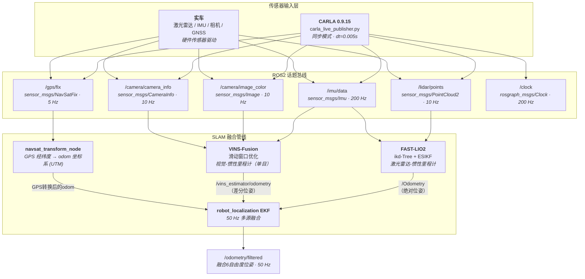
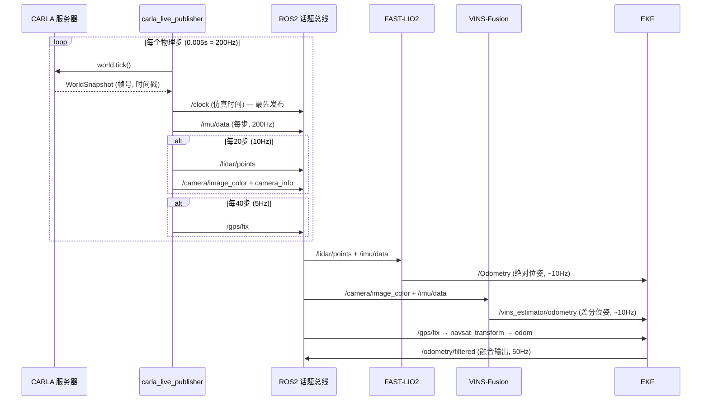
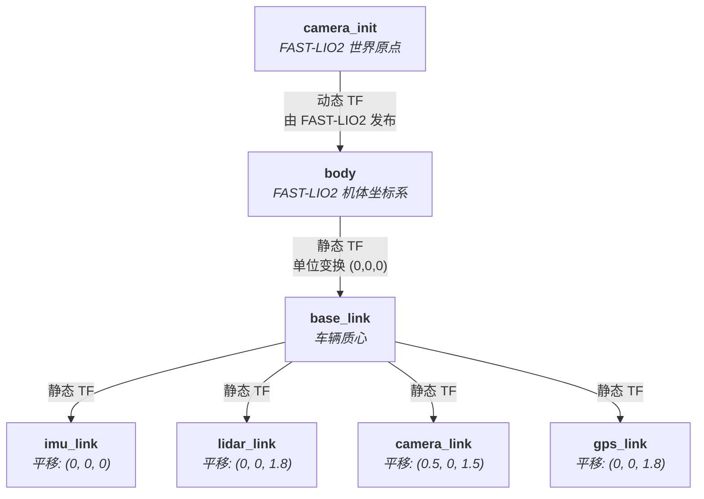

# LIO-VIO-GPS 融合 — 多源 SLAM 管线

> **[English Documentation](README.md)**

一个 **ROS2 Humble** 多源 SLAM 融合工作空间，将三种互补的里程计系统整合为一条松耦合定位管线：

| 模块 | 算法 | 输入 | 输出 |
|------|------|------|------|
| **FAST-LIO2** | ikd-Tree + 迭代误差状态卡尔曼滤波 | 激光雷达 + IMU | 6自由度位姿（绝对） |
| **VINS-Fusion** | 滑动窗口非线性优化（Ceres） | 单目相机 + IMU | 6自由度位姿（相对） |
| **robot_localization** | 扩展卡尔曼滤波器 | 各里程计源 + GPS | 融合全局位姿 |

同时支持 **CARLA 0.9.15 仿真**（内置实时传感器桥接和时钟服务器）和 **实车部署**（接入传感器驱动即可运行）。

### 实机演示 — CARLA 自动驾驶 + 实时 LIO 建图


*Tesla Model 3 在 CARLA Town10HD 里开启 autopilot 连续行驶（忽略红灯/停止标志以保证录像不中断）。右侧为统一 RViz 视图 `slam_carla.rviz`：彩虹色是 FAST-LIO2 累积建图，中心亮红色圆环是当前配准扫描，左上插图为车载前视相机实时画面。整条管线和 RViz 用一条命令启动（`ros2 launch slam_bringup carla_full.launch.py`）。*

### 当前进度

| 组件 | 状态 | 备注 |
|------|------|------|
| CARLA 桥接 (`carla_bridge`) | ✅ 可用 | autopilot + 观察相机跟随 + 忽略红灯/停车标志 |
| FAST-LIO2（LiDAR + IMU） | ✅ 可用 | 10 Hz，每帧 ~65k 点，为 CARLA 调优了雷达密度 |
| robot_localization EKF | ✅ 可用 | 融合 FAST-LIO2（当前未接 VINS） |
| GPS / GNSS | ⚠️ 部分 | `/gps/fix` 已发布，`navsat_transform` 已运行，但**尚未回馈到 EKF 做位姿融合** |
| VINS-Fusion（相机 + IMU） | 🚧 开发中 | 配置解析通过，但第一帧就 segfault（图像编码 / 去畸变路径），默认关闭 |
| 统一 RViz 布局 | ✅ 可用 | `slam_carla.rviz` 随 launch 自动打开；可用 `rviz:=false` 关闭 |

---

## 目录

- [系统架构](#系统架构)
- [数据流](#数据流)
- [TF 坐标树](#tf-坐标树)
- [工作空间结构](#工作空间结构)
- [环境要求](#环境要求)
- [编译](#编译)
- [快速开始 — CARLA 仿真](#快速开始--carla-仿真)
- [快速开始 — 实车部署](#快速开始--实车部署)
- [ROS2 话题](#ros2-话题)
- [启动文件](#启动文件)
- [配置指南](#配置指南)
- [CARLA 传感器桥接细节](#carla-传感器桥接细节)
- [架构设计决策](#架构设计决策)
- [常见问题排查](#常见问题排查)
- [许可证](#许可证)

---

## 系统架构



### 为什么选择这个架构？

- **松耦合** — 每个 SLAM 模块作为独立的 ROS2 节点运行。某个模块崩溃或产生异常数据时，其他模块不受影响。可以随时增减传感器。
- **FAST-LIO2 作为主定位源** — 激光雷达-惯性里程计几何特征丰富、抗漂移能力强，为 EKF 提供绝对位姿参考。
- **VINS-Fusion 作为补充** — 视觉-惯性里程计捕获激光雷达无法感知的纹理信息（如特征稀疏环境）。以 **差分模式** 融入 EKF，避免其累积漂移与 FAST-LIO2 的绝对估计产生冲突。
- **GPS 用于全局锚定** — `navsat_transform_node` 将 WGS84 坐标转换到本地里程计坐标系，防止室外场景下的长期漂移。

---

## 数据流



**关键时序规则**：CARLA 桥接节点在每个物理步中**先发布 `/clock`**，再发布传感器数据。这确保所有下游 `use_sim_time` 节点在接收新测量数据前已更新时钟。

---

## TF 坐标树



| 变换 | 类型 | 发布者 | 说明 |
|------|------|--------|------|
| `camera_init` → `body` | 动态 | FAST-LIO2 | 按激光雷达扫描频率更新 (~10 Hz) |
| `body` → `base_link` | 静态 | `fastlio2.launch.py` | 单位变换 — 桥接 FAST-LIO2 坐标系到 ROS 标准 |
| `base_link` → `imu_link` | 静态 | CARLA桥接 / `slam_pipeline.launch.py` | 与 base_link 共位 |
| `base_link` → `lidar_link` | 静态 | CARLA桥接 / `slam_pipeline.launch.py` | base_link 上方 1.8m |
| `base_link` → `camera_link` | 静态 | CARLA桥接 / `slam_pipeline.launch.py` | 前方 0.5m, 上方 1.5m |
| `base_link` → `gps_link` | 静态 | CARLA桥接 / `slam_pipeline.launch.py` | base_link 上方 1.8m |

---

## 工作空间结构

```
lio_vio_gps_ws/
├── src/
│   ├── FAST_LIO_ROS2/                  # [git子模块] Ericsii/FAST_LIO_ROS2
│   │   ├── config/                     #   内置配置文件 (avia, velodyne, ouster, mid360)
│   │   ├── launch/mapping.launch.py    #   原生启动文件
│   │   └── src/                        #   C++源码 (laserMapping, preprocess, IMU_Processing)
│   │
│   ├── VINS-Fusion-ROS2/              # [git子模块] fanhong-li/VINS-Fusion-ROS2-Humble
│   │   ├── vins/                       #   核心VIO估计器 (vins_node)
│   │   ├── loop_fusion/               #   回环检测（可选）
│   │   ├── global_fusion/             #   GPS+VIO全局优化（可选）
│   │   └── camera_models/             #   相机模型库
│   │
│   └── slam_bringup/                  # [ament_python] 集成包
│       ├── package.xml
│       ├── setup.py / setup.cfg
│       ├── config/
│       │   ├── fastlio2_carla.yaml     #   FAST-LIO2 — CARLA仿真
│       │   ├── fastlio2_real.yaml      #   FAST-LIO2 — 实车（模板）
│       │   ├── vins_carla_mono.yaml    #   VINS-Fusion — CARLA单目
│       │   ├── vins_real_mono.yaml     #   VINS-Fusion — 实车（模板）
│       │   └── ekf_navsat.yaml         #   robot_localization EKF + NavSat
│       ├── launch/
│       │   ├── carla_full.launch.py    #   CARLA桥接 + 完整SLAM管线
│       │   ├── slam_pipeline.launch.py #   实车SLAM管线
│       │   ├── fastlio2.launch.py      #   FAST-LIO2 独立启动
│       │   ├── vins_fusion.launch.py   #   VINS-Fusion 独立启动
│       │   └── ekf_fusion.launch.py    #   EKF + NavSat 独立启动
│       └── slam_bringup/
│           ├── __init__.py
│           └── carla_live_publisher.py #   CARLA→ROS2 传感器桥接
│
├── carla_live_publisher.py            # 根目录副本，方便独立运行
├── README.md                          # 英文文档
├── README_zh-CN.md                    # 中文文档
├── .gitignore
└── .gitmodules
```

---

## 环境要求

| 组件 | 版本 | 用途 |
|------|------|------|
| Ubuntu | 22.04 LTS | 全部 |
| ROS2 | Humble Hawksbill | 全部 |
| Python | 3.10+ | 全部 |
| Ceres Solver | 2.0+ | VINS-Fusion |
| PCL | 1.12+ | FAST-LIO2 |
| Eigen | 3.3+ | FAST-LIO2, VINS-Fusion |
| CARLA | 0.9.15 | 仅仿真 |
| Conda 环境 `carla_env` | — | 仅 CARLA 桥接 |

### 系统依赖安装

```bash
# ROS2 功能包
sudo apt install ros-humble-robot-localization \
                 ros-humble-pcl-conversions \
                 ros-humble-tf2-ros \
                 ros-humble-cv-bridge

# VINS-Fusion 编译依赖
sudo apt install libceres-dev libgoogle-glog-dev libgflags-dev

# 可选：可视化
sudo apt install ros-humble-rviz2
```

### Python 依赖（仅 CARLA 桥接）

在 `carla_env` conda 环境中：

```
carla==0.9.15       # CARLA PythonAPI
rclpy               # ROS2 Python 客户端
sensor_msgs         # Imu, PointCloud2, Image, CameraInfo, NavSatFix
tf2_ros             # StaticTransformBroadcaster
cv_bridge           # OpenCV ↔ ROS 图像转换
numpy               # PointCloud2 打包的数组运算
```

---

## 编译

```bash
# 1. 克隆仓库
git clone --recursive git@github.com:UGA-MOBILITY-LAB/lio_vio_gps_ws.git
cd lio_vio_gps_ws

# 2. 初始化子模块（若克隆时未使用 --recursive）
git submodule update --init --recursive

# 3. 安装系统依赖
sudo apt install ros-humble-robot-localization libceres-dev

# 4. 编译工作空间
source /opt/ros/humble/setup.bash
colcon build --symlink-install

# 5. 加载工作空间
source install/setup.bash
```

> **注意**：FAST-LIO2 和 VINS-Fusion 是 C++ 包，首次编译可能需要数分钟。

---

## 快速开始 — CARLA 仿真

### 终端 1：启动 CARLA 服务器

```bash
cd ~/carla_sim
./CarlaUE4.sh
# 等待 CARLA 窗口完全加载
```

### 终端 2：一条命令启动完整管线

```bash
conda activate carla_env
source ~/lio_vio_gps_ws/install/setup.bash
ros2 launch slam_bringup carla_full.launch.py
# 可选参数：
#   rviz:=false   # 不启动 RViz 窗口（无头模式）
#   vins:=true    # 启用 VINS-Fusion（开发中，默认关闭）
```

一条命令同时启动：
1. **carla_live_publisher** — 连接 CARLA，生成车辆 + 传感器，发布所有话题 + `/clock`；观察相机自动跟随 ego vehicle，在 CARLA 窗口里始终能看到车
2. **FAST-LIO2** — 订阅 `/lidar/points` + `/imu/data`，发布 `/Odometry` 以及累积建图 `/Laser_map`
3. **VINS-Fusion** — 可选（`vins:=true`），订阅 `/camera/image_color` + `/imu/data`，发布 `/vins_estimator/odometry`
4. **robot_localization EKF** — 融合 `/Odometry`（VINS 开启时也含 `/vins_estimator/odometry`），发布 `/odometry/filtered`
5. **navsat_transform** — 将 `/gps/fix` 转换到 map 坐标系
6. **RViz2** — 使用 `slam_carla.rviz` 打开相机画面、FAST-LIO 建图、里程计轨迹和 TF（`rviz:=false` 可关）

### 终端 3：验证

```bash
source ~/lio_vio_gps_ws/install/setup.bash

# 检查所有话题是否正常
ros2 topic list

# 验证频率
ros2 topic hz /imu/data                  # 期望 ~200 Hz
ros2 topic hz /lidar/points              # 期望 ~10 Hz
ros2 topic hz /camera/image_color        # 期望 ~10 Hz
ros2 topic hz /gps/fix                   # 期望 ~5 Hz
ros2 topic hz /clock                     # 期望 ~200 Hz
ros2 topic hz /Odometry                  # 期望 ~10 Hz (FAST-LIO2)
ros2 topic hz /vins_estimator/odometry   # 期望 ~10 Hz (VINS-Fusion)
ros2 topic hz /odometry/filtered         # 期望 ~50 Hz (EKF)

# 查看 TF 坐标树
ros2 run tf2_tools view_frames
# → 生成 frames.pdf 显示完整的 TF 树

# RViz2 可视化
ros2 run rviz2 rviz2
# 添加显示：PointCloud2 (/lidar/points), Image (/camera/image_color),
# Odometry (/Odometry, /odometry/filtered), TF
```

### 或者独立运行 CARLA 桥接

```bash
conda activate carla_env
cd ~/lio_vio_gps_ws
python3 carla_live_publisher.py

# 使用自定义参数：
python3 carla_live_publisher.py --ros-args \
    -p carla_host:=localhost \
    -p carla_port:=2000 \
    -p town:=Town01 \
    -p vehicle_filter:=vehicle.tesla.model3 \
    -p fixed_delta_seconds:=0.005
```

---

## 快速开始 — 实车部署

### 1. 配置传感器参数

编辑 `*_real.yaml` 配置文件以匹配你的硬件。所有标记 `# TODO` 的行都需要更新：

**FAST-LIO2** (`config/fastlio2_real.yaml`)：
```yaml
preprocess:
    lidar_type: 2            # 1=Livox Avia, 2=Velodyne, 3=Ouster, 4=Livox Mid-360
    scan_line: 64            # 你的激光雷达线数
    timestamp_unit: 0        # 0=秒, 1=毫秒, 2=微秒, 3=纳秒（匹配你的驱动）
mapping:
    extrinsic_T: [0, 0, 0]  # 激光雷达 → IMU 平移 [x, y, z] 单位：米
    extrinsic_R: [1, 0, 0, 0, 1, 0, 0, 0, 1]  # 激光雷达 → IMU 旋转（行主序）
```

**VINS-Fusion** (`config/vins_real_mono.yaml`)：
```yaml
# 从相机标定获得（如 kalibr 或 OpenCV）
projection_parameters:
    fx: 640.0    # 从标定结果填入
    fy: 640.0
    cx: 640.0
    cy: 360.0
distortion_parameters:
    k1: 0.0      # 从标定结果填入
    k2: 0.0
    p1: 0.0
    p2: 0.0

# 从 IMU 数据手册获得
acc_n: 0.1       # 加速度计噪声密度 [m/s^2/sqrt(Hz)]
gyr_n: 0.01      # 陀螺仪噪声密度 [rad/s/sqrt(Hz)]
acc_w: 0.001     # 加速度计随机游走 [m/s^3/sqrt(Hz)]
gyr_w: 0.0001    # 陀螺仪随机游走 [rad/s^2/sqrt(Hz)]

# IMU-相机外参（使用 kalibr 标定或手动测量）
body_T_cam0: !!opencv-matrix
    rows: 4
    cols: 4
    dt: d
    data: [1, 0, 0, 0,  0, 1, 0, 0,  0, 0, 1, 0,  0, 0, 0, 1]
```

### 2. 启动

```bash
source ~/lio_vio_gps_ws/install/setup.bash

# 先启动传感器驱动（激光雷达、IMU、相机、GPS）
# 然后启动 SLAM 管线：
ros2 launch slam_bringup slam_pipeline.launch.py \
    fastlio2_config:=fastlio2_real.yaml \
    vins_config:=vins_real_mono.yaml
```

### 3. 传感器驱动需发布的话题

启动管线前，你的传感器驱动必须发布以下话题：

| 话题 | 类型 | 期望频率 |
|------|------|----------|
| `/imu/data` | `sensor_msgs/Imu` | 100–400 Hz |
| `/lidar/points` | `sensor_msgs/PointCloud2` | 10–20 Hz |
| `/camera/image_color` | `sensor_msgs/Image` | 10–30 Hz |
| `/gps/fix` | `sensor_msgs/NavSatFix` | 1–10 Hz |

---

## ROS2 话题

### 传感器话题（输入）

| 话题 | 消息类型 | 频率 | 坐标系 | 消费者 |
|------|----------|------|--------|--------|
| `/clock` | `rosgraph_msgs/Clock` | 200 Hz | — | 所有节点（仿真时间） |
| `/imu/data` | `sensor_msgs/Imu` | 200 Hz | `imu_link` | FAST-LIO2, VINS-Fusion |
| `/lidar/points` | `sensor_msgs/PointCloud2` | 10 Hz | `lidar_link` | FAST-LIO2 |
| `/camera/image_color` | `sensor_msgs/Image` | 10 Hz | `camera_link` | VINS-Fusion |
| `/camera/camera_info` | `sensor_msgs/CameraInfo` | 10 Hz | `camera_link` | VINS-Fusion |
| `/gps/fix` | `sensor_msgs/NavSatFix` | 5 Hz | `gps_link` | navsat_transform |

### 里程计话题（输出）

| 话题 | 消息类型 | 频率 | 来源 | EKF 模式 |
|------|----------|------|------|----------|
| `/Odometry` | `nav_msgs/Odometry` | ~10 Hz | FAST-LIO2 | **绝对** — 主定位源 |
| `/vins_estimator/odometry` | `nav_msgs/Odometry` | ~10 Hz | VINS-Fusion | **差分** — 仅用相对变化量 |
| `/odometry/filtered` | `nav_msgs/Odometry` | 50 Hz | robot_localization EKF | — 最终融合输出 |

### PointCloud2 字段布局

| 字段 | 数据类型 | 偏移量 | 大小 |
|------|----------|--------|------|
| `x` | FLOAT32 | 0 | 4 字节 |
| `y` | FLOAT32 | 4 | 4 字节 |
| `z` | FLOAT32 | 8 | 4 字节 |
| `intensity` | FLOAT32 | 12 | 4 字节 |
| `ring` | **UINT16** | 16 | 2 字节 |
| *（填充）* | — | 18 | 2 字节 |
| `time` | FLOAT32 | 20 | 4 字节 |

**每点步长：24 字节**。`ring` 字段为 `UINT16`（非 `FLOAT32`），以匹配 FAST-LIO2 `preprocess.h` 中的 `velodyne_ros::Point` 结构体。这一点至关重要 — PCL 的 `fromROSMsg` 使用 `memcpy` 按 `min(src_size, dest_size)` 字节复制，类型不匹配会产生错误的 ring 值。

---

## 启动文件

| 文件 | 说明 | `use_sim_time` |
|------|------|----------------|
| `carla_full.launch.py` | CARLA桥接 + FAST-LIO2 + VINS-Fusion + EKF + NavSat | `true`（桥接节点除外） |
| `slam_pipeline.launch.py` | FAST-LIO2 + VINS-Fusion + EKF + NavSat（无CARLA） | `false` |
| `fastlio2.launch.py` | FAST-LIO2 + 静态TF `body→base_link` | 可配置 |
| `vins_fusion.launch.py` | VINS-Fusion 估计器 | 可配置 |
| `ekf_fusion.launch.py` | robot_localization EKF + navsat_transform | 可配置 |

### 启动参数

| 参数 | 默认值 | 使用者 |
|------|--------|--------|
| `use_sim_time` | `true` | 所有启动文件 |
| `config_file` | 因文件而异 | `fastlio2.launch.py`, `vins_fusion.launch.py` |
| `fastlio2_config` | `fastlio2_real.yaml` | `slam_pipeline.launch.py` |
| `vins_config` | `vins_real_mono.yaml` | `slam_pipeline.launch.py` |
| `carla_host` | `localhost` | `carla_full.launch.py` |
| `carla_port` | `2000` | `carla_full.launch.py` |
| `town` | `Town10HD` | `carla_full.launch.py` |

### 启动示例

```bash
# CARLA 完整管线
ros2 launch slam_bringup carla_full.launch.py \
    carla_host:=localhost carla_port:=2000 town:=Town10HD

# 实车管线
ros2 launch slam_bringup slam_pipeline.launch.py \
    fastlio2_config:=fastlio2_real.yaml \
    vins_config:=vins_real_mono.yaml

# 单独启动各节点
ros2 launch slam_bringup fastlio2.launch.py \
    config_file:=fastlio2_carla.yaml use_sim_time:=true
```

---

## 配置指南

### FAST-LIO2 配置

配置文件：`fastlio2_carla.yaml`（仿真），`fastlio2_real.yaml`（实车模板）

| 参数 | CARLA 值 | 说明 |
|------|----------|------|
| `lidar_type` | `2`（Velodyne） | 1=Livox Avia, 2=Velodyne, 3=Ouster, 4=Mid-360 |
| `scan_line` | `64` | 激光雷达线数 |
| `timestamp_unit` | `0`（秒） | 点时间戳单位：0=秒, 1=毫秒, 2=微秒, 3=纳秒 |
| `imu_topic` | `/imu/data` | IMU 话题名 |
| `lid_topic` | `/lidar/points` | 激光雷达话题名 |
| `extrinsic_T` | `[0, 0, 1.8]` | 激光雷达 → IMU 平移（米） |
| `extrinsic_R` | 单位矩阵 | 激光雷达 → IMU 旋转（3×3，行主序） |
| `det_range` | `100.0` | 最大检测距离（米） |
| `filter_size_surf` | `0.5` | 曲面体素降采样尺寸 |
| `acc_cov` / `gyr_cov` | `0.1` | IMU 噪声协方差 |

### VINS-Fusion 配置

配置文件：`vins_carla_mono.yaml`（仿真），`vins_real_mono.yaml`（实车模板）

> **重要**：VINS-Fusion 使用 **OpenCV FileStorage 格式**（`%YAML:1.0`），不是标准 YAML。配置路径通过 **命令行参数**（`argv[1]`）传入，不是 ROS 参数。

| 参数 | CARLA 值 | 说明 |
|------|----------|------|
| `model_type` | `PINHOLE` | 相机模型（PINHOLE, KANNALA_BRANDT, MEI） |
| `image_width/height` | `1280 × 720` | 图像分辨率 |
| `fx, fy, cx, cy` | `640, 640, 640, 360` | 相机内参 |
| `body_T_cam0` | 见配置文件 | 4×4变换矩阵：相机坐标系 → 机体(IMU)坐标系 |
| `acc_n` / `gyr_n` | `0.1` / `0.01` | IMU 噪声密度 |
| `acc_w` / `gyr_w` | `0.001` / `0.0001` | IMU 随机游走 |
| `max_cnt` | `150` | 每帧最大跟踪特征数 |
| `estimate_extrinsic` | `0`（固定） | 0=固定, 1=在线优化, 2=粗略初始值 |
| `estimate_td` | `0` | 估计 IMU-相机时间偏移 |
| `loop_closure` | `0` | 回环检测（0=关闭, 1=开启） |

### robot_localization EKF 配置

配置文件：`ekf_navsat.yaml`

| 参数 | 值 | 说明 |
|------|-----|------|
| `frequency` | `50.0` | EKF 输出频率 (Hz) |
| `odom0` | `/Odometry` | FAST-LIO2 里程计（绝对模式） |
| `odom0_differential` | `false` | 使用 LIO 的绝对位姿 |
| `odom1` | `/vins_estimator/odometry` | VINS-Fusion 里程计（差分模式） |
| `odom1_differential` | `true` | 使用 VIO 的相对变化量 |
| `world_frame` | `odom` | EKF 在 odom 坐标系中运行 |

`navsat_transform_node` 使用 UTM 投影将 GPS `NavSatFix` 消息转换到本地里程计坐标系，提供全局位置锚定。

---

## CARLA 传感器桥接细节

### 传感器配置

| 传感器 | CARLA 蓝图 | 关键属性 | 频率 | 安装位置 |
|--------|-----------|----------|------|----------|
| IMU | `sensor.other.imu` | 默认噪声模型 | 200 Hz | (0, 0, 0) — 车辆质心 |
| 激光雷达 | `sensor.lidar.ray_cast` | 64线, 130万点/秒, 100m范围, 视场 [-25°, +15°] | 10 Hz | (0, 0, 1.8) — 车顶 |
| 相机 | `sensor.camera.rgb` | 1280×720, FOV 90° | 10 Hz | (0.5, 0, 1.5) — 前方 |
| GNSS | `sensor.other.gnss` | WGS84 经/纬/高 | 5 Hz | (0, 0, 1.8) — 车顶 |

### 坐标变换：CARLA → ROS

CARLA 使用**左手坐标系**，ROS 使用**右手坐标系**。Y 轴方向相反：

```
CARLA（左手系）                   ROS（右手系）
    Z ↑                              Z ↑
    |                                |
    +------→ Y（右）                  +------→ X（前）
   /                                /
  ↙ X（前）                         ↙ Y（左）
```

| 数据类型 | 变换规则 | 说明 |
|----------|---------|------|
| 位置 / 平移 | `(x, -y, z)` | 取反 Y |
| 线加速度 | `(ax, -ay, az)` | 取反 Y |
| 角速度 | `(gx, -gy, -gz)` | 伪矢量：取反 Y 和 Z |
| 欧拉角 → 四元数 | `(roll, -pitch, -yaw)` | 取反 pitch 和 yaw |
| 激光雷达点云 | `points[:, 1] *= -1` | 对所有点取反 Y 列 |

### 相机内参

```
FOV = 90°, 分辨率 = 1280×720
fx = fy = width / (2 · tan(FOV/2)) = 1280 / (2 · tan(45°)) = 640.0
cx = 640.0 (width / 2)
cy = 360.0 (height / 2)
畸变 = [0, 0, 0, 0, 0]  (CARLA 无畸变)
```

### 时钟服务器行为

CARLA 桥接节点是整个 ROS2 图的**时钟服务器**：
- 以 200 Hz 发布 `/clock`（每个物理步）
- 每步**先发布 `/clock`**，再发布传感器数据
- 桥接节点自身**不使用** `use_sim_time`（它本身就是时间源）
- 所有下游 SLAM 节点**必须**设置 `use_sim_time: true`

### QoS 配置

所有传感器话题使用 **BEST_EFFORT** 可靠性策略，追求最低延迟：

| 话题 | 队列深度 | 原因 |
|------|----------|------|
| `/clock` | 10 | 不可丢失 |
| `/imu/data` | 1 | 高频率，只需最新 |
| `/lidar/points` | 2 | 大消息，小缓冲 |
| `/camera/image_color` | 2 | 大消息，小缓冲 |
| `/camera/camera_info` | 2 | 与图像同步 |
| `/gps/fix` | 5 | 低频率，小消息 |

### 清理

桥接节点优雅处理 `SIGINT`（Ctrl+C）和 `SIGTERM`：

1. 停止并销毁所有 4 个 CARLA 传感器
2. 销毁自驾车辆 actor
3. 恢复 CARLA 世界为异步模式
4. 禁用 traffic manager 同步模式

---

## 架构设计决策

| 决策 | 原因 |
|------|------|
| **通过 EKF 松耦合** | 每个 SLAM 模块独立运行。轻松增减传感器。VIO 在黑暗中失效时，LIO+GPS 不受影响 |
| **FAST-LIO2 绝对 + VINS 差分** | LIO 抗漂移（几何特征）；VIO 补充纹理信息但会漂移。差分模式避免与 FAST-LIO2 的绝对估计冲突 |
| **CARLA 桥接作为时钟服务器** | 确定性锁步执行：先发 `/clock` → 再发传感器数据 → 下游节点按序处理 |
| **`ring` 字段为 UINT16** | FAST-LIO2 的 `velodyne_ros::Point` 定义 `ring` 为 `uint16_t`。PCL 的 `fromROSMsg` 用 `memcpy` — 类型不匹配导致静默数据损坏 |
| **VINS 配置用 OpenCV YAML** | VINS-Fusion 通过 `cv::FileStorage` 读取配置，需要 `%YAML:1.0` 头。标准 YAML 解析器不兼容 |
| **仿真/实车配置分离** | 相同的启动架构，换一个 YAML 文件即可。实车配置含 `# TODO` 标记 |
| **Git 子模块** | 自包含工作空间，FAST-LIO2 和 VINS-Fusion 版本固定，构建可复现 |
| **静态 TF `body→base_link`** | 桥接 FAST-LIO2 内部坐标系（`camera_init→body`）到 ROS 标准（`odom→base_link`） |

---

## 常见问题排查

| 问题 | 解决方案 |
|------|----------|
| FAST-LIO2 启动时段错误 | 检查 `lidar_type` 是否匹配 PointCloud2 字段布局。CARLA 使用 `lidar_type: 2`（Velodyne 模式） |
| VINS-Fusion "config file not found" | 配置路径通过 `argv[1]` 传入。检查文件是否存在于 `install/share/slam_bringup/config/` |
| VINS-Fusion 没有输出里程计 | 确保 `/camera/camera_info` 与 `/camera/image_color` 一起发布。检查 `body_T_cam0` 外参是否合理 |
| EKF 输出不动 | 检查 `/Odometry` 和 `/vins_estimator/odometry` 是否正在发布。检查 `ekf_navsat.yaml` 中的 `odom0_config` / `odom1_config` 数组 |
| GPS 没有融入 | `navsat_transform_node` 需要 `/gps/fix` 和 `/odometry/filtered` 两者（循环依赖 — EKF 必须先运行） |
| CARLA 桥接清理时崩溃 | 如果 CARLA 服务器先被关闭，这是正常的。桥接在清理时会捕获异常 |
| 找不到 TF "base_link" | 确保 `fastlio2.launch.py` 在运行（它发布 `body→base_link` 静态 TF） |
| `colcon build` 编译 VINS-Fusion 失败 | 安装 `libceres-dev` 和 `libgoogle-glog-dev`。检查 Ceres 版本 ≥ 2.0 |

---

## 许可证

MIT

---

*面向自动驾驶研究的多源 SLAM 融合管线 — 从仿真到实车部署。*
