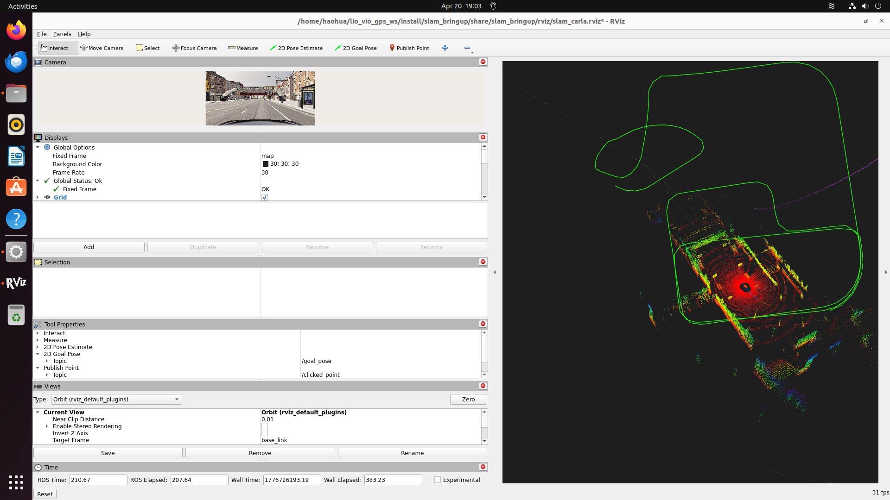

# Super-LIO vs FAST-LIO2 z-drift debugging snapshot (2026-04-20)

First live smoke test of the Super-LIO integration on CARLA Town10HD. Both
LIOs drift significantly in z — contrary to the expectation that Super-LIO's
octree voxel map would suppress the z-drift that plagues FAST-LIO2.



## Numeric snapshot (~100 s of driving, car is physically at z ≈ 0)

| Source | Topic | Frame | x (m) | y (m) | **z (m)** |
|---|---|---|---:|---:|---:|
| Super-LIO | `/lio/odom` | `world` | +141.37 | +2.35 | **+73.68** |
| FAST-LIO2 | `/Odometry` | `camera_init` | +174.43 | +47.06 | **−38.29** |
| EKF local | `/odometry/local` | `odom` | +141.51 | +2.50 | 0.000 (2D-locked) |
| EKF global | `/odometry/global` | `map` | +5866.26 | +2088.08 | 0.000 (2D-locked) |
| GPS fix | `/gps/fix` | — | lat −0.00117, lon +0.00053 | | alt +1.80 |
| Navsat out | `/odometry/gps` | — | **NOT RECEIVED** | | |

## Observations

1. **Super-LIO z-drifts +73 m upward** in ~100 s. The advertised improvement
   over FAST-LIO2's z-drift does **not** hold with the current config.
2. **FAST-LIO2 z-drifts −38 m downward** — the two LIOs drift in *opposite*
   directions, so averaging them would not help.
3. **XY is coherent**: Super-LIO and the local EKF agree to within 15 cm in
   both x and y. FAST-LIO2 XY is already off by ~30 m, hinting that it is
   tracking an independent (and worse) solution.
4. **2D mode is masking the z-drift downstream** — both EKFs clamp z=0, so
   the map→base_link TF looks fine even with LIO going underground/skyward.
   The drift is only visible on the raw LIO topics.
5. **Navsat not publishing `/odometry/gps`**. The bridge is publishing
   `/gps/fix` near the datum (lat/lon ≈ 0), but `navsat_transform_node`
   logged only "Datum" messages, never produced an output topic. Likely
   the magnetic_declination / yaw_offset / datum handshake is not
   completing because the CARLA GPS reports lat/lon so close to (0,0)
   that UTM-zone flipping occurs (log showed zone changing between 30M
   and 30N, i.e. hemisphere boundary).
6. **Green FAST-LIO trail in RViz loops** — consistent with the car
   going around the block under autopilot, but the trail is visibly
   rising/falling by tens of metres in the perspective view.

## Hypotheses for the Super-LIO z-drift

1. **`lidar_type: 5` (vel_nclt) mis-parses CARLA scans.** NCLT is HDL-32E
   (32 rings, specific ring→vertical-angle table, specific time field
   layout). CARLA is 64 rings with `ring: uint16` and `t: float32` in
   seconds. The per-ring vertical-angle assumption used inside Super-LIO
   is probably wrong, so scan-line compensation is mis-projecting points.
2. **Per-point time unit mismatch.** CARLA's `t[0.0000, 0.0050]` is
   seconds-within-scan. Super-LIO's PointCloud2 handler may expect
   nanoseconds or time-relative-to-scan-start in a different unit —
   this directly corrupts de-skewing during high angular velocity.
3. **Extrinsic `lidar_imu`**: we copied FAST-LIO2's `extrinsic_T = [0,0,1.8]`
   (lidar in imu frame, translation only). Super-LIO's `lio.extrinsic.lidar_imu`
   uses the same convention (translation + row-major R), but if
   Super-LIO actually interprets it as `imu_in_lidar` (inverse) the sign
   of the z-offset would be flipped — which matches the opposite drift
   directions between Super-LIO (+z) and FAST-LIO (−z).
4. **IMU noise too loose.** We set `imu_na / imu_ng = 0.1` (copied from
   the hesai config). CARLA's IMU is essentially noise-free; 0.1 lets
   the filter trust accelerometer bias too much.
5. **`filter_rate: 3`** discards two out of three points, reducing the
   observation density the octree map can constrain against.

## Suggested next experiments

1. **Verify extrinsic sign**: swap `extrinsic.lidar_imu` translation to
   `[0, 0, -1.8]` and see if Super-LIO z-drift flips. If yes,
   convention mismatch confirmed; pick the sign that stays flat.
2. **Try `lidar_type: 4` (velo32)** — simpler path, no NCLT-specific
   ring table. CARLA's 64-ring scan will just be treated as 32-ring
   behaviour but the vertical-angle assumption should be closer.
3. **Tighten IMU noise**: `imu_na: 0.01`, `imu_ng: 0.01` (CARLA IMU
   is near-ideal).
4. **Drop `filter_rate` to 1** (use every point).
5. **Debug navsat separately**: move the CARLA GPS datum away from
   (0,0) so UTM zone is stable, e.g. publish at San Francisco lat/lon
   instead of Town10HD's default.

## How this was reproduced

```bash
# Terminal 1
DISPLAY=:1 ~/carla_sim/CarlaUE4.sh -quality-level=Low -windowed -ResX=1024 -ResY=768

# Terminal 2
source /opt/ros/humble/setup.bash
source install/setup.bash
conda activate carla_env
ros2 launch slam_bringup carla_full.launch.py
# wait for "Warmup complete — autopilot engaged" + Super-LIO "Map init done"
# let the car autopilot for ~100 s, then inspect /lio/odom z
```
